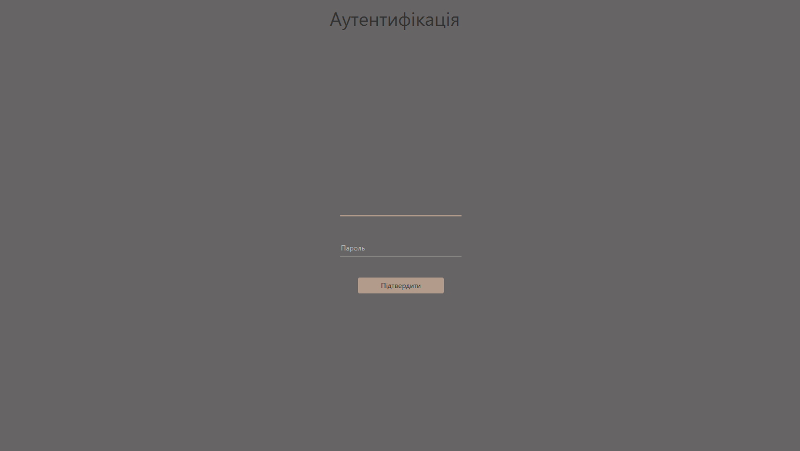
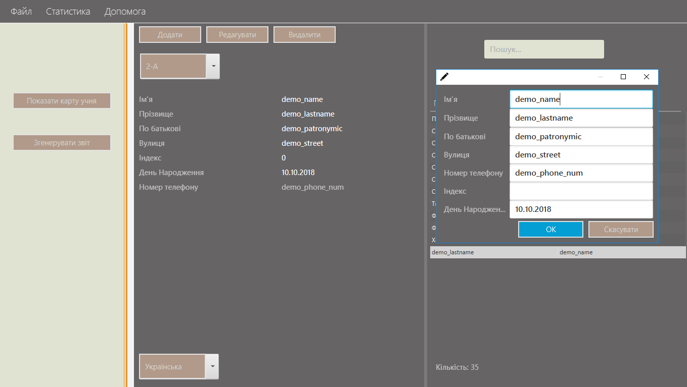
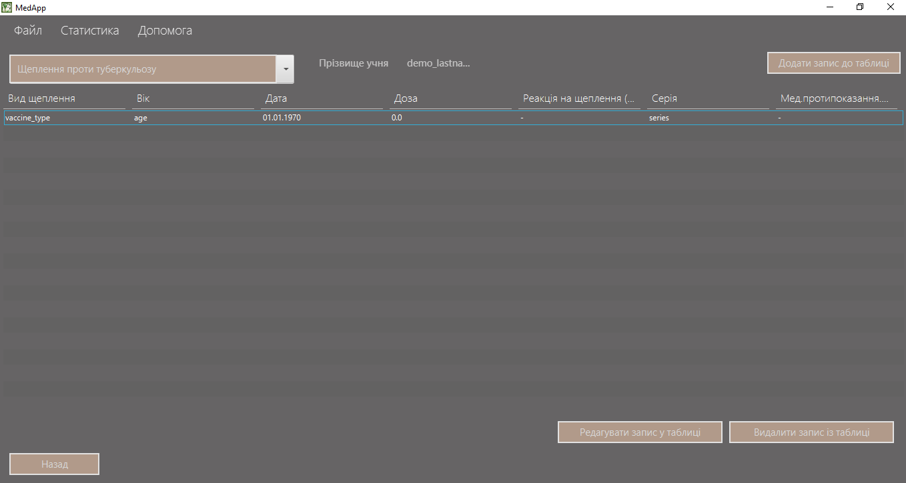

# DrMed
(not completed)
The project that will help optimize the work of nurses when filling in medical vaccination cards.

### Login page

### Main page

### Vaccination page

## Current Features
- [x] User authentication
- [x] Create/Delete/Search/Edit pupils
- [x] Support two locale RU/UA
- [x] Read xls/xlsx format to extract information about pupils
- [x] Generation of docx report about pupils vaccine
- [x] Document management
- [x] Create/Delete/Edit vaccine
- [x] Vaccine support(not all)
- [x] Internal vaccine repository( as XML doc)

## Requirements
Java 8

## Common Technologies
Project is created with:
* JavaFx+SceneBuilder 
* ApachePoi

## Entry point
MainApp.java

# Built With
* [Maven](https://maven.apache.org/) - Dependency Management

